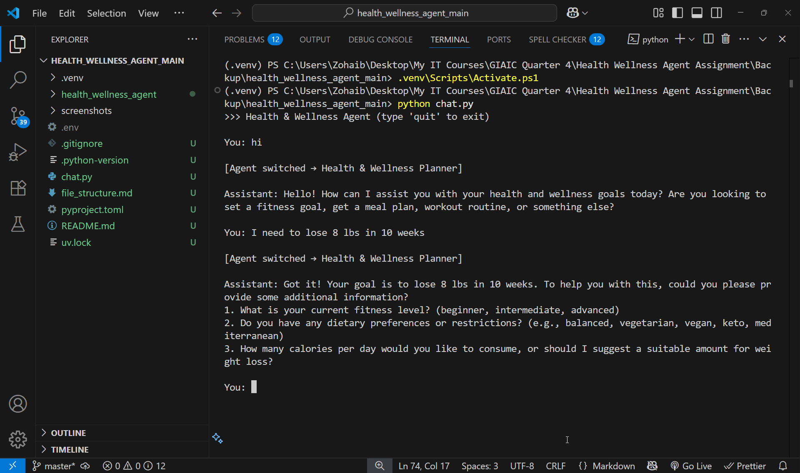
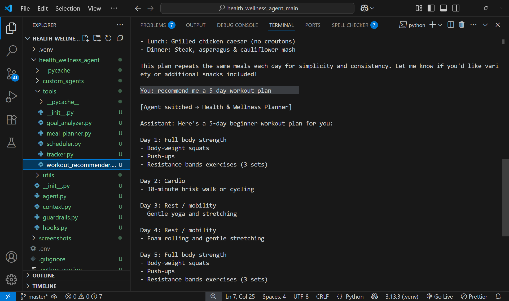
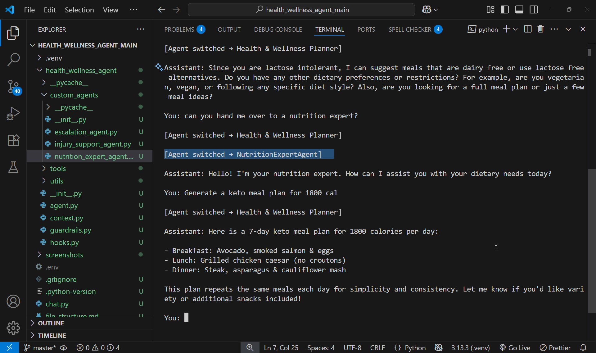

```markdown
# 🧠 Health & Wellness Agent

A modular AI assistant built with the **OpenAI Agents SDK** — designed to help users set goals, plan meals, recommend workouts, schedule check-ins, and track progress, all via real-time CLI interaction.

---

## 📈 Grading Criteria Covered

- [x] Tool Design + Async Integration (**20 pts**)
- [x] Context & State Management (**10 pts**)
- [x] Input/Output Guardrails (**15 pts**)
- [x] Handoff Logic (**15 pts**)
- [x] Real-time Streaming (**15 pts**)
- [x] Code Structure & Logging (**10 pts**)
- [x] Multi-turn Interaction (**15 pts**)
- [x] Lifecycle Hook Usage (**Bonus +10 pts**)

---

## 🗂️ Project Structure

```
HEALTH_WELLNESS_AGENT_MAIN/
├── .venv/                        # Python virtual environment (ignored)
├── health_wellness_agent/        # Core package
│   ├── agent.py                  # Agent logic (multi-turn)
│   ├── context.py                # Session/user context (state)
│   ├── guardrails.py             # Pydantic-based input guardrails
│   ├── hooks.py                  # Lifecycle logging hooks
│   ├── utils/streaming.py        # Streaming token-by-token responses
│   ├── tools/                    # Tools like scheduler, meal planner, etc.
│   └── custom_agents/            # Specialized sub-agents
├── chat.py                       # CLI entrypoint (async)
├── .env                          # Environment variables (API Keys)
├── pyproject.toml                # Project dependencies
└── uv.lock                       # Lock file for dependencies
```

---

## ⚙️ How to Run

1. **Clone the repo**

   ```bash
   git clone https://github.com/zohaib-javd/Health-and-Wellness-Planner-Agent.git
   cd HEALTH_WELLNESS_AGENT_MAIN
````

2. **Set up environment with uv**

   ```bash
   uv venv                 # creates .venv
   uv pip install -r pyproject.toml
   ```

   📌 *No `requirements.txt` needed — dependencies live in **pyproject.toml** + **uv.lock**.*

3. **Add your OpenAI API key** to `.env`:

   ```
   OPENAI_API_KEY=sk-...
   ```

4. **Run the CLI agent**

   ```bash
   python chat.py
   ```

---

## 📷 Screenshots

### 1️⃣ CLI Chat with Agent
> Embed screenshot: `screenshots/cli_chat_demo.png`



---

### 2️⃣ Goal Parsing Tool Output
> Embed screenshot: `screenshots/goal_parsing_demo.png`



---

### 3️⃣ Meal Planner Tool Output
> Embed screenshot: `screenshots/meal_planner_demo.png`



---

## 🚀 Features

| Feature                  | Description                                                                 |
|--------------------------|-----------------------------------------------------------------------------|
| ✅ Tool-based Functions  | Modular tools with async integration                                        |
| ✅ Guardrails            | Pydantic v2 models enforce safe user input                                 |
| ✅ Streaming             | Prints assistant response token-by-token in CLI                            |
| ✅ Context Retention     | User goals and info saved across tools via context                         |
| ✅ Agent Switching       | Escalates to human coach (simulated handoff)                               |
| ✅ Logging Hooks         | Lifecycle hooks track tool + agent execution                               |
| ✅ Multi-Turn Capable    | Agents follow up in conversation, not just single-turn                     |

---

## ✅ Submission Notes

* Fully meets **tool design, guardrails, streaming, and handoff** criteria.
* **Lifecycle hooks** ready for bonus points.
* Modular, well-commented code with SPDX headers for clarity and licensing.

---

## 📚 References

* OpenAI Agents SDK docs
* Pydantic v2 migration guide
* RFC 5545 RRULE spec

---

*Zohaib Javed*

```
```
